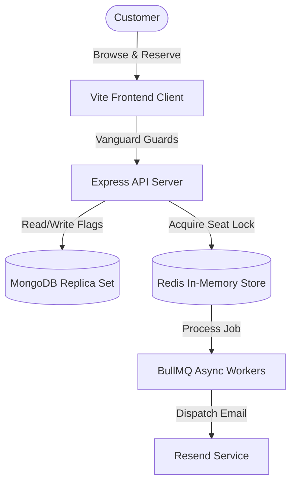

# SUVAIALAYA SOUTH INDIAN CUISINE
## Project Proposal & Cost Quotation (Startup Edition)

---

### Executive Summary
**Suvaialaya** is a high-performance, enterprise-grade Event & Restaurant Booking SaaS Platform designed specifically for the restaurant industry. It handles high-concurrency ticket reservations, slot allocations, real-time kitchen queues, admin dashboards, security layers, and automated ticketing workflows. 

This document details the software development costs, architectural breakdown, hosting optimization, and on-demand maintenance retainers tailored to keep capital expenditures minimal for a startup.

---

## 1. Project Financial Summary

| Billing Item | Startup Tier (INR) | Startup Tier (USD) | Payment Schedule / Nature |
| :--- | :--- | :--- | :--- |
| **A. Phase-Wise Development Fee** | **₹1,80,000** | **$2,160** | One-Time (50% Advance / 50% Delivery) |
| **B. Monthly Hosting & Operational Costs** | **~₹500 / month** | **~$6 / month** | Monthly (Billed directly by Host Provider) |
| **C. Post-Launch Maintenance & Support** | **₹0 / month** | **$0 / month** | Billed On-Demand (₹750 / hr or $10 / hr) |

---

## 2. Comprehensive Functional Scope (What is Built)

The development fee covers the implementation of **21 pages** and a robust backend middleware ecosystem.

### A. Frontend Modules (React 18 + Vite)
1. **Interactive Landing Page (`Index.tsx`)**: High-fidelity masonry layouts showcasing South Indian culinary galleries, real-time ticket sales tracking, and direct booking flows.
2. **Responsive Menu & Gallery Pages (`Menu.tsx`, `Gallery.tsx`)**: Premium menu display with responsive category filter switches and loaded culinary visuals.
3. **Dynamic Slot & Seat Selection (`SlotSelection.tsx`)**: Polling checks that query available slots and prevent users from choosing expired times.
4. **Secure Checkout Forms (`BookingForm.tsx`, `Payment.tsx`)**: Zod-validated registration forms capturing guest counts, names, and contact details, coupled with payment flows.
5. **Multi-Role User Dashboard (`UserDashboard.tsx`)**: Client account panel showing historical bookings, download links for PDF receipts, QR tickets, and quick cancellation triggers.

### B. Specialized Operations Control Panels (RBAC Enforced)
* **Admin Control Center (`AdminDashboard.tsx`)**: High-fidelity dashboard visualizing revenue analytics, booking ledgers, CSV ledger exports, capacity config settings, and emergency feature flag switches.
* **Receptionist Ledger (`ReceptionDashboard.tsx`)**: Designed for onsite hostesses to check guests in, review daily guest list tallies, and filter by payment states.
* **Kitchen Production Panel (`KitchenDashboard.tsx`)**: Grid updates showing real-time dietary requirements (e.g., spice levels, allergies) and aggregate pax summaries.
* **Door Scanner app (`QRScanner.tsx`, `TicketVerification.tsx`)**: Fully integrated browser-based QR scanner using device cameras for immediate ticket validation and check-in confirmation.

### C. Authentication & Security Gateways
* BCrypt hashing protection for client credentials.
* OTP Verification flow (`VerifyOTP.tsx`) for two-factor checkout protection.
* Secure Forgot/Reset Password flows (`ForgotPassword.tsx`, `ResetPassword.tsx`).

---

## 3. Technology Stack & DevOps Architecture

Suvaialaya is engineered using a robust **Three-Tier Architecture** configured for maximum vertical scale on single-instance systems.

* **Frontend**: React 18 SPA, Vite, Tailwind CSS 3, Radix UI.
* **Backend**: Express 5.0 (Node.js 20+), Winston Logger, Prometheus metrics.
* **Databases**: MongoDB 6+ (replica set configuration for atomic transaction rollbacks).
* **Caching & Queue Processing**: Redis 7+, BullMQ (asynchronous email and QR generators).
* **Security Middleware**:
  * `helmet`: Guarding HTTP headers.
  * `express-rate-limit` + Redis store: DoS/Brute-force protection.
  * `express-mongo-sanitize`: SQL/NoSQL Injection blocker.
  * `HttpOnly, Secure, SameSite=Strict` cookies to defend against XSS.

---

## 4. Development Fee Allocation (₹1,80,000 / $2,160)

The one-time engineering fee is calculated based on **270 hours** of development:

1. **Design & Core Frontend (75 Hours - ₹50,000 / $600)**
   * Structuring responsive layout sheets, animations, typography, and SVG assets.
   * Designing user dashboards, scanner layouts, and receptionist grids.
2. **Backend REST API & Database (90 Hours - ₹65,000 / $780)**
   * Implementing atomic transaction locks (using Redis locks) to prevent double-booking of single seats.
   * Designing endpoints for analytics dashboards, waitlist routing, and authentication.
3. **Queue Processing & Services (45 Hours - ₹30,000 / $360)**
   * Implementing BullMQ workers for background email template compilation and PDF ticket generation.
   * Creating email delivery hooks (Resend API) for confirmation and cancellations.
4. **DevOps, Security & SRE Integrations (60 Hours - ₹35,000 / $420)**
   * Building Docker container architectures (Node + MongoDB + Redis + Prometheus + Nginx).
   * Configuring the Memory Watchdog and rotational database backup engine to protect against database corruption.
   * Writing chaos testing scripts to verify local offline execution resilience.

---

## 5. Startup Hosting Cost Optimization

To support early-stage startups, we avoid expensive database hosts (like MongoDB Atlas) and caching hosts (like Redis Enterprise). Instead, we run everything on **one single Virtual Private Server (VPS)**.

### Standard Cloud Setup vs. Startup Optimized Setup

| Hosting Component | Standard Hosting (Enterprise) | Startup Optimized Hosting | How We Save |
| :--- | :--- | :--- | :--- |
| **App & Frontend Host** | $15 Droplet (DigitalOcean) | Included in Single VPS | Run together using Docker. |
| **MongoDB Database** | MongoDB Atlas Dedicated ($60/mo) | Self-hosted Database ($0/mo) | MongoDB replica set configured inside a Docker volume. |
| **Redis Cache / Queue** | Managed Redis ($15/mo) | Self-hosted Redis ($0/mo) | Redis container run in the same internal network. |
| **Transactional Emails**| Resend Paid Tier ($20/mo) | Resend Free Tier ($0/mo) | Bypassed fees by staying under 3,000 free emails/mo. |
| **Database Backups** | AWS S3 Storage ($5/mo) | GDrive Sync ($0/mo) | Local backup cron uploads archives to a free-tier drive. |
| **Security Auditing** | Paid vulnerability scans ($50/mo) | Trivy & Gitleaks ($0/mo) | Integrated free security scanners in the CI/CD pipeline. |
| **Monthly Burn Rate**| **~₹10,500 / month ($125)** | **~₹500 / month ($6)** | **Saved ₹10,000 ($119) every month.** |

---

## 6. Maintenance & Support SLA

To keep the startup from paying unnecessary monthly fees when the app is running smoothly, we utilize an **On-Demand Maintenance Agreement**:

* **Monthly Retainer**: **₹0 ($0)**. No payments are required unless you request changes.
* **On-Demand Assistance**: Billed at **₹750 / hour ($10 / hour)**.
* **Emergency Hotfixes (P1 Issues)**: Billed at the standard hourly rate, with guaranteed investigation within 4 hours.
* **Standard Updates**: Includes simple menu adjustments, logo modifications, and text shifts (completed within 24-48 hours of ticket creation).
* **Security Upkeep**: Automatic checking and fixing of NPM package vulnerabilities to maintain passing status on Gitleaks and Trivy.
