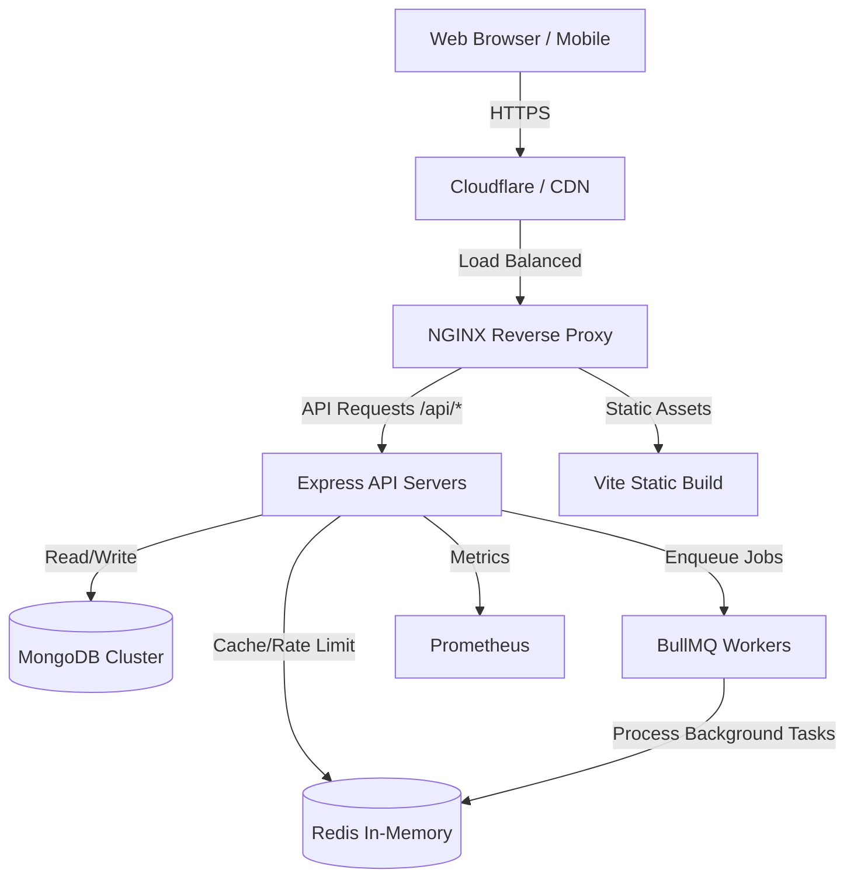
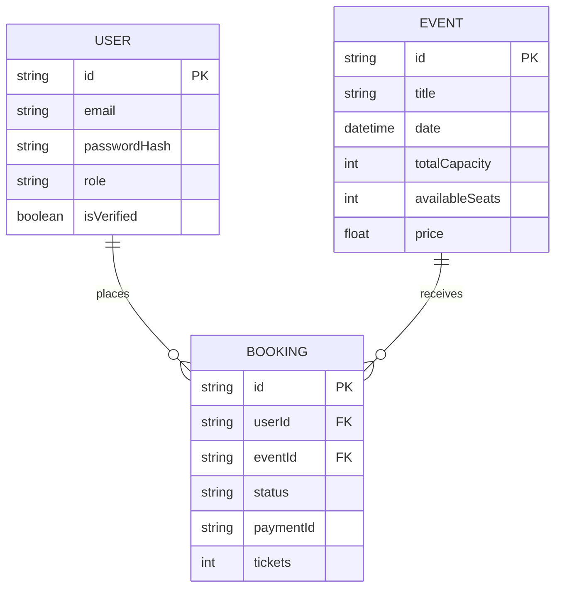

<div align="center">
  
  <h1>🎟️ Suvaialaya Event Ticket Hub</h1>
  <p><strong>Enterprise-Grade Event Management & Ticketing Platform</strong></p>
  
  []()
  []()
  []()
  []()
  []()
  []()
</div>

---

## 🌟 Executive Summary

Suvaialaya Event Ticket Hub is a high-performance, horizontally scalable event management and ticketing platform. Engineered for production workloads, it leverages a robust **React 18 SPA frontend** coupled with a **Node.js/Express 5 backend**. 

The architecture incorporates enterprise-grade patterns including **Redis** for stateful caching and rate-limiting, **BullMQ** for asynchronous distributed task processing, and **MongoDB** for flexible data modeling. The entire ecosystem is containerized via **Docker** and orchestrated with **Docker Compose**, utilizing **NGINX** as a reverse proxy for traffic routing and SSL termination.

---

## 🏗️ System Architecture

### High-Level Design (HLD)



### Database Entity Relationship



---

## 🛠️ Technology Stack Analysis

### Frontend Ecosystem
*   **React 18 & Vite**: Delivers a lightning-fast Single Page Application (SPA) with hot module replacement (HMR) for optimal developer experience.
*   **Tailwind CSS & Radix UI**: Utility-first CSS combined with unstyled, accessible component primitives ensuring a responsive, premium UI.
*   **Framer Motion**: Orchestrates complex micro-animations and page transitions.

### Backend Ecosystem
*   **Node.js & Express 5**: Non-blocking asynchronous event-driven backend.
*   **TypeScript**: Enforces strict typings across client and server (via `shared/` contracts).
*   **MongoDB & Mongoose**: Schema-based NoSQL database for rapid feature iteration and complex querying.
*   **Redis & BullMQ**: Handles critical asynchronous workflows (PDF ticket generation, email dispatching) preventing main-thread blocking.

### DevOps & Infrastructure
*   **Docker & Docker Compose**: Ensures complete environment parity from local development to production.
*   **NGINX**: Acts as an edge router, serving static files and proxying dynamic API requests.
*   **Prometheus**: Real-time observability, metric scraping, and alerting infrastructure.

---

## 🔐 Security Architecture

Security is integrated at the core of the application lifecycle:
*   **Network Level**: NGINX configuration prevents direct access to internal services.
*   **Application Level**: 
    *   `helmet`: Enforces strict HTTP headers (HSTS, X-Frame-Options).
    *   `express-rate-limit` + `rate-limit-redis`: Protects against brute-force and DDoS attacks.
    *   `express-mongo-sanitize`: Mitigates NoSQL injection vulnerabilities.
*   **Authentication**: Stateless JWT tokens stored in HttpOnly cookies, mitigating XSS risks. Passwords hashed via `bcryptjs`.

---

## 🚀 Universal Setup Guide

### 1. Local Development (Windows / macOS / Linux)

**Prerequisites:** Node.js (v20+), pnpm (v10+), MongoDB, Redis.

```bash
# 1. Clone the repository
git clone https://github.com/prawinkumar2k/suvaialaya.git
cd suvaialaya

# 2. Install dependencies
pnpm install

# 3. Configure environment variables
cp .env.example .env
# Edit .env with your local MongoDB and Redis URIs

# 4. Start the development server (Frontend + Backend concurrently)
pnpm dev
```

### 2. Production Docker Deployment

Deploying the full stack securely using container orchestration.

```bash
# 1. Ensure Docker and Docker Compose are installed
# 2. Configure production .env variables
# 3. Build and launch the cluster in detached mode
docker-compose up -d --build

# 4. Monitor logs
docker-compose logs -f
```

---

## 📈 Scalability & Performance

*   **Caching Strategy**: Heavy read operations and session data are cached in Redis to reduce MongoDB load.
*   **Background Processing**: Email notifications and PDF rendering are offloaded to BullMQ workers, ensuring the API responds in `< 50ms`.
*   **Horizontal Scaling**: The API is completely stateless, allowing seamless horizontal scaling behind NGINX or an AWS Application Load Balancer.

---

## 🤝 Contributing

We follow a strict Git Flow branching strategy.
1. Fork the Project
2. Create your Feature Branch (`git checkout -b feature/AmazingFeature`)
3. Commit your Changes (`git commit -m 'feat: Add some AmazingFeature'`)
4. Push to the Branch (`git push origin feature/AmazingFeature`)
5. Open a Pull Request

---

## 📄 License

Distributed under the MIT License. See `LICENSE` for more information.

<div align="center">
  <p>Engineered with ❤️ for the Suvaialaya Platform</p>
</div>
