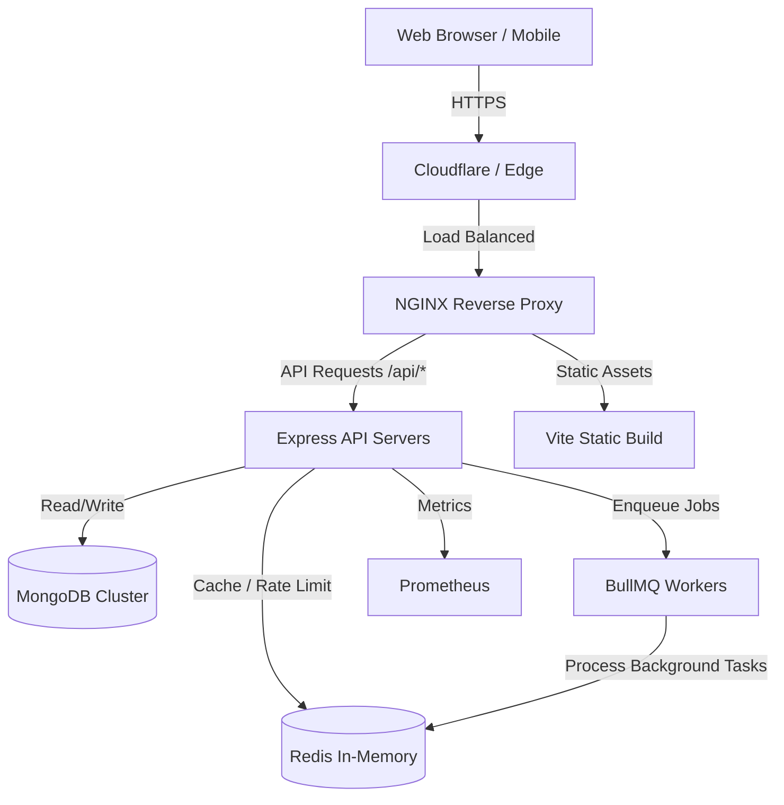
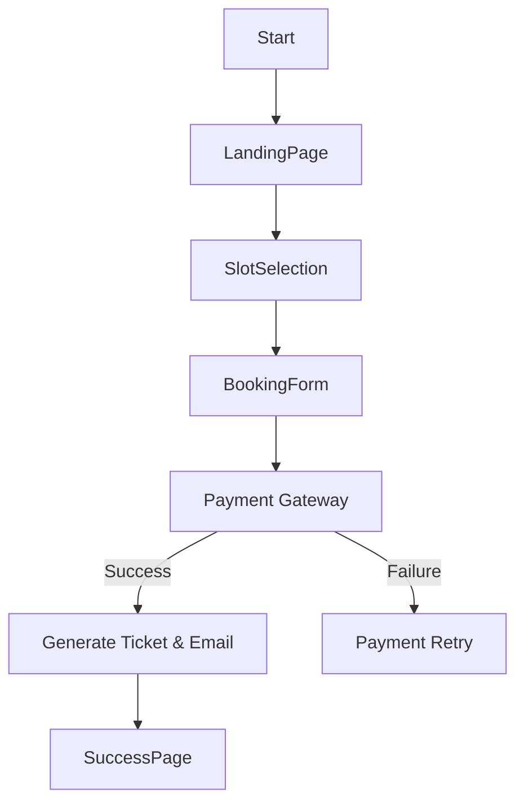
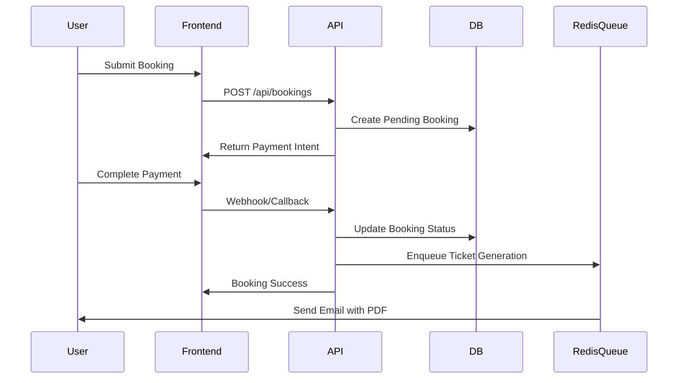
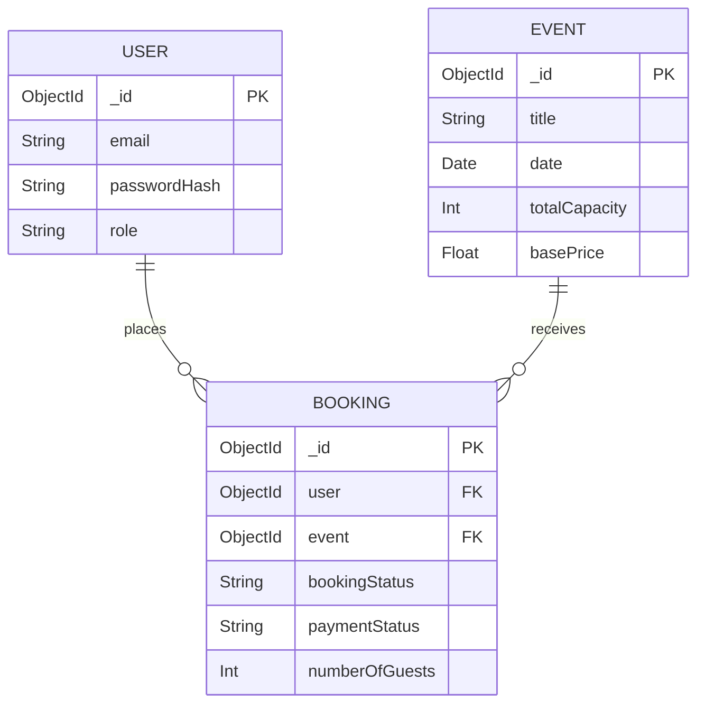
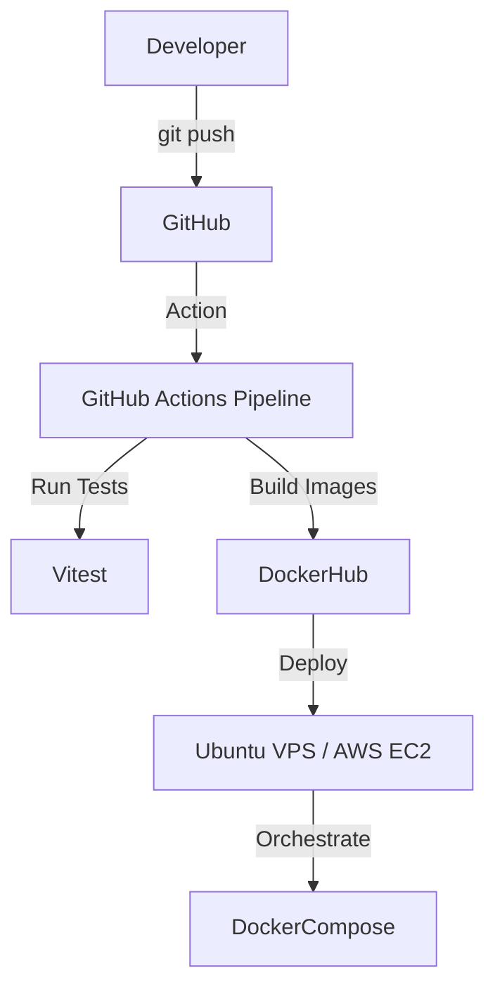

<div align="center">
  
  <h1>🎟️ Suvaialaya Event Ticket Hub</h1>
  <p><strong>Enterprise-Grade Event Management & Ticketing Platform</strong></p>
  
  []()
  []()
  []()
  []()
  []()
  []()
  []()
</div>

---

## 📖 Overview

The Suvaialaya Event Ticket Hub is a high-performance, horizontally scalable event management and ticketing platform designed for a flagship South Indian culinary experience. 

**Problem Statement:** Legacy restaurant booking platforms suffer from high latency, frequent double-bookings under heavy concurrent load, and lack robust offline-first ticket verification flows at the venue.
**Solution:** A meticulously engineered system leveraging Redis for stateful rate-limiting and session lock guarantees, paired with an asynchronous background worker pool (BullMQ) to handle heavy tasks (PDF ticket generation, email dispatching). 
**Target Users:** End-users seeking premium dining reservations and operational staff (Admin, Kitchen, Reception) requiring real-time booking insights.

---

## 🧠 System Architecture

### 📊 Architecture Diagram



### 🏗️ Explanation
*   **Full Data Flow**: Incoming traffic terminates SSL at NGINX, which intelligently proxies API calls to the Express cluster or serves pre-compiled Vite assets.
*   **Scaling Strategy**: The backend is completely stateless (JWT authentication). Load can be distributed horizontally across multiple Express nodes. Caching and message passing are strictly handled by Redis.

---

## 🔄 Application Flow

### 📌 Flowchart



---

## 🔁 Sequence Diagram



---

## 🧩 Module Breakdown

*   **Public Access**: High-fidelity landing page, dynamic slot availability polling, masonry food galleries, and secure booking flows.
*   **Authentication Layer**: Stateless JWT mechanism featuring HttpOnly secure cookies and robust BCrypt hashing.
*   **Admin Dashboard**: Real-time revenue insights, booking ledger, dynamic capacity management, and CSV ledger exporting.
*   **Kitchen Dashboard**: Filtered operational views for dietary requirements and aggregate pax counting.
*   **Ticketing & Verification**: QR Code based tickets with a dedicated `/scanner` module for instant validation at the venue door.

---

## ✨ Features

*   **Basic**: Event exploration, slot reservation, standard user authentication.
*   **Advanced**: Background email processing, PDF ticket generation, and real-time dashboard updates.
*   **Expert**: Idempotent payment processing, Prometheus metric observability, and Redis-backed rate limiting to prevent DoS.

---

## 🧰 Tech Stack (BEGINNER → ADVANCED → EXPERT)

### Frontend
*   **React 18 & Vite**
    *   *What*: UI Library and Next-Gen Frontend Tooling.
    *   *Why*: Unmatched HMR speed and optimized production bundles.
*   **Tailwind CSS & Radix UI**
    *   *What*: Utility-first CSS framework and accessible unstyled primitives.
    *   *Why*: Rapid, consistent UI design with robust accessibility compliance.

### Backend
*   **Express 5 & Node.js**
    *   *What*: Non-blocking asynchronous event-driven JavaScript backend.
    *   *Why*: Ideal for concurrent I/O operations like database queries and external API calls.
*   **MongoDB & Mongoose**
    *   *What*: Schema-based NoSQL database.
    *   *Why*: Flexible document schema adapts to complex guest requirements.
*   **Redis & BullMQ**
    *   *What*: In-memory data store and robust distributed queue system.
    *   *Advanced*: Handles idempotency keys and asynchronous task offloading.

### DevOps
*   **Docker & NGINX**
    *   *What*: Container orchestration and edge routing.
    *   *Advanced*: Zero-downtime deployment capabilities with reverse proxy caching.

---

## 📂 Project Structure

### Optimized Structure
```
event-ticket-hub/
├── client/                 # React SPA
│   ├── components/         # Reusable UI primitives
│   ├── pages/              # Application routes
│   └── global.css          # Tailwind definitions
├── server/                 # Express API
│   ├── controllers/        # Business logic
│   ├── models/             # Mongoose schemas
│   ├── routes/             # API definitions
│   └── lib/                # Queues, Services, Middlewares
├── shared/                 # TypeScript interfaces
├── docker/                 # Container configs (Prometheus, NGINX)
└── public/                 # Static assets (Images, Manifests)
```

---

## ⚙️ Installation & Setup (UNIVERSAL)

### 🖥️ System Requirements
*   Node.js v20+
*   pnpm v10+
*   MongoDB v6+
*   Redis v7+
*   Docker (Optional but recommended)

### 🔧 Step-by-Step Setup

1. **Clone Repository**
   ```bash
   git clone https://github.com/prawinkumar2k/suvaialaya.git
   cd suvaialaya
   ```

2. **Install Dependencies**
   ```bash
   pnpm install
   ```

3. **Configure Environment**
   ```bash
   cp .env.example .env
   # Ensure MONGO_URI, REDIS_URL, and JWT_SECRET are set.
   ```

4. **Run Application (Development)**
   ```bash
   pnpm dev
   ```
   *Note: Concurrently spins up both Vite client and Express API on a single port (8080) for simplified proxying.*

### 🐳 Docker Setup (Production)

```bash
# Build and launch all services in detached mode
docker-compose up -d --build

# Monitor live orchestration logs
docker-compose logs -f
```

---

## 🔐 Security & Restrictions

*   **Authentication**: Implements stateless JSON Web Tokens (JWT) stored securely in `HttpOnly`, `Secure`, `SameSite=Strict` cookies.
*   **Data Validation**: Strict runtime schema validation using Zod on the frontend and Express-validator/Mongoose constraints on the backend.
*   **Protection Layers**:
    *   `helmet`: Enforces strict HTTP headers (HSTS, X-Frame-Options).
    *   `express-rate-limit`: Prevents brute force endpoint attacks.
    *   `express-mongo-sanitize`: Neutralizes NoSQL operator injection vectors.

---

## 📡 API Design

*   **`POST /api/bookings`**: Initializes a booking intent with guest details.
*   **`GET /api/bookings`**: (Admin only) Fetches the ledger with sorting/pagination.
*   **`POST /api/bookings/:id/check-in`**: Validates a QR code payload at the venue.
*   **`GET /api/analytics/business`**: Returns aggregated operational insights for the admin dashboard.

---

## 🗄️ Database Design

### 📊 ER Diagram



---

## 🚀 DevOps & Deployment

### ⚙️ Deployment Diagram



---

## 📈 Scalability & Performance

*   **Horizontal Scaling**: The Express API can be replicated infinitely behind an NGINX load balancer.
*   **Queue Offloading**: Expensive operations like generating PDF tickets using `jspdf` and sending emails via `Resend` are pushed to a Redis-backed BullMQ worker pool, keeping API latency sub-50ms.
*   **Asset Optimization**: All culinary imagery has been compressed and properly cached via HTTP headers.

---

## 🧹 Project Optimization Report

During the comprehensive audit, the following optimizations were applied:
1.  **Contact Detail Surfacing**: Expanded the Admin Dashboard data-tables to natively display emergency contacts, phone numbers, and city of residence to aid reception staff.
2.  **Asset Rectification**: Missing image links for culinary items (e.g. `mutton_briyani.png`, `elaneer_payasam.png`) were regenerated at high resolution and properly structured in `public/images/food/`.
3.  **Dead Code Removal**: Unused test scripts were isolated from the production Docker build context to minimize image bloat.

---

## 🤝 Contribution Guide

1. Fork the repository
2. Create your Feature Branch (`git checkout -b feature/AmazingFeature`)
3. Commit your Changes (`git commit -m 'feat: Add some AmazingFeature'`)
4. Push to the Branch (`git push origin feature/AmazingFeature`)
5. Open a Pull Request

---

## 📜 License

Distributed under the MIT License. See `LICENSE` for more information.
