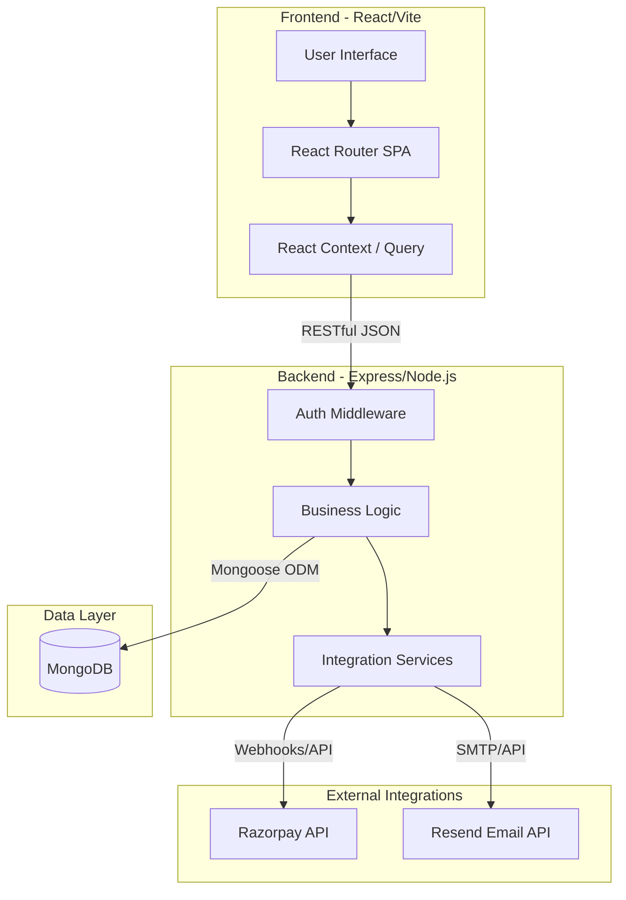
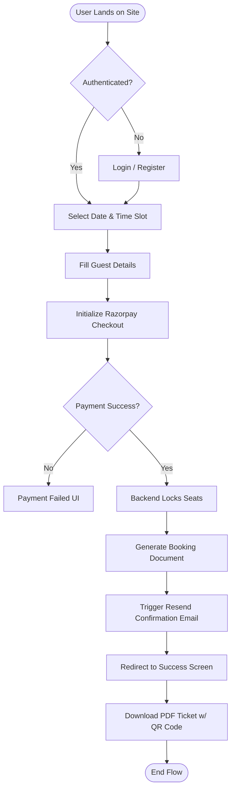
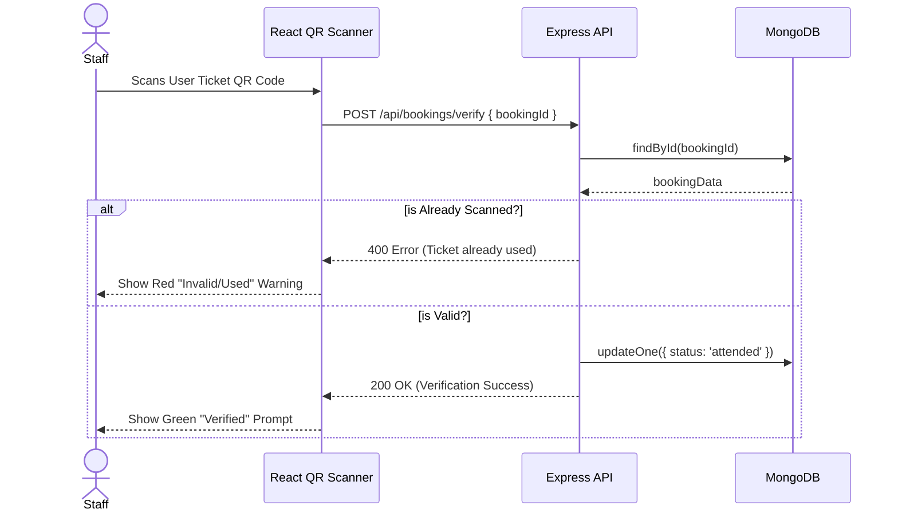
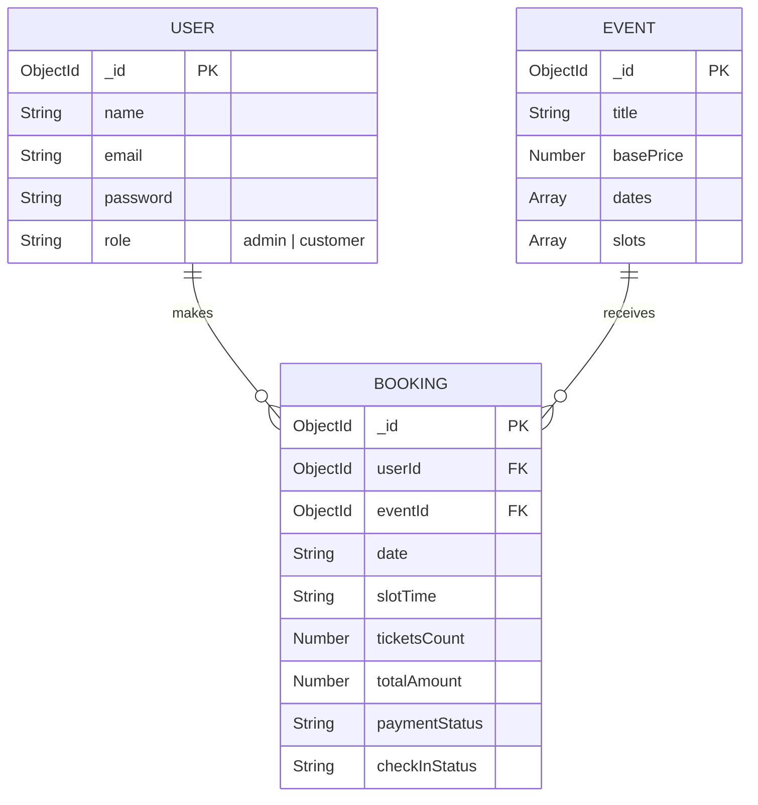
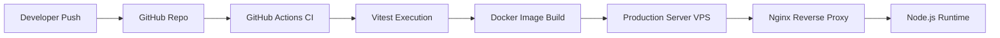

<div align="center">

# 🏛️ Suvaialaya Event Management System (SEMS)

[](#)
[](#)
[](#)
[](#)
[](#)
[](https://opensource.org/licenses/MIT)

**An enterprise-grade, high-concurrency event ticketing and restaurant reservation platform.**<br>
Built with the modern MERN stack, offering real-time capacity locking, automated PDF ticket generation, integrated payment gateways, and advanced QR-code event check-ins.

[Features](#-features) • [Architecture](#-system-architecture) • [API Design](#-api-design) • [Installation](#%EF%B8%8F-installation--setup-universal--foolproof) • [Database](#%EF%B8%8F-database-design)

</div>

---

## 📖 Overview

### 🚨 Problem Statement
Restaurants and event venues struggle with managing high-demand, limited-capacity dining events (like the *Madurai Kari Virunthu*). Traditional booking methods lead to overbooking, manual ledger errors, zero fraud protection, and a disjointed user experience lacking premium brand identity. 

### 💡 Solution
The **Suvaialaya Event Management System (SEMS)** is a full-stack, production-ready SPA that automates the entire ticketing lifecycle. It guarantees robust concurrency control (seat locking), seamless hybrid payment processing, instant transactional email confirmations, and digital QR-code check-ins at the door to prevent duplicate entries—all wrapped in a beautifully branded, responsive "Heritage Luxury" aesthetic.

---

## 🧠 System Architecture

SEMS is designed as a **Client-Server SPA Monolith** optimized for rapid development and containerized deployment.

### 📊 Architecture Diagram



### 🏗️ Explanation
* **Data Flow**: The React frontend executes REST API calls to the Express backend. The backend strictly validates payload integrity (via Zod/custom validation) before querying MongoDB. 
* **State Management**: Asynchronous server state is managed, while local UI state uses React hooks.
* **Concurrency Strategy**: The backend employs atomic MongoDB operations (`$inc`) to prevent race conditions during booking surges, guaranteeing capacity limits are never exceeded.

---

## 🔄 Application Flow

### 📌 Booking Flowchart



---

## 🔁 Sequence Diagram: Event Check-in



---

## 🧩 Module Breakdown

1. **Authentication Module**: JWT-based stateless authentication featuring secure HTTP-only cookie paradigms (or Bearer tokens), robust password hashing (`bcrypt`), and OTP-based password recovery.
2. **Booking Engine**: The core business logic. It handles asynchronous payment webhooks, atomic seat decrementing, and booking state machine transitions (Pending → Confirmed → Attended).
3. **Notification Service**: An abstraction layer currently mapped to **Resend**, responsible for assembling HTML-templated transactional emails.
4. **Admin Ledger**: An analytical dashboard fetching protected aggregations from MongoDB, rendering live revenue metrics, and executing client-side CSV exports for offline accounting.
5. **Scanner Module**: A browser-based camera integration decoding QR payloads to validate entry at the physical venue.

---

## ✨ Features

### 🟢 Core (Beginner)
* **Responsive UI**: "Heritage Luxury" aesthetic built with TailwindCSS.
* **User Authentication**: Secure Login/Register flows.
* **Event Landing Page**: High-fidelity marketing copy, dynamic menus, and FAQ sections.

### 🟡 Advanced
* **PDF Ticket Generation**: On-the-fly rendering of branded E-Tickets (`jsPDF`), embedding dynamically generated QR codes.
* **Payment Gateway Integration**: Secure hybrid checkout using Razorpay.
* **Automated Emails**: Instant booking confirmations routed via Resend API.
* **Admin CSV Export**: In-browser conversion of complex JSON booking arrays to downloadable CSV ledgers.

### 🔴 Expert
* **Concurrency Seat Locking**: Transactional safety ensuring multiple concurrent users cannot overbook a time slot.
* **Role-Based Access Control (RBAC)**: Strict API middleware segregating standard users from administrative endpoints.
* **Comprehensive Test Suite**: Automated unit testing of booking algorithms utilizing `Vitest` and `Supertest`.

---

## 🧰 Tech Stack

| Technology | Role | Implementation Details |
| :--- | :--- | :--- |
| **React 18** | Frontend Library | Utilized as a SPA. Component-driven architecture using hooks. |
| **Vite** | Build Tooling | Provides instantaneous HMR and optimized production bundling. |
| **TailwindCSS 3** | Styling Engine | Utility-first styling combined with customized brand color tokens. |
| **Express.js** | Backend Framework | RESTful API routing, middleware chaining, and error handling. |
| **MongoDB / Mongoose** | Database & ODM | NoSQL document storage with strict schema definitions and atomic updates. |
| **Razorpay** | Payment Processor | Hybrid integration (Client-side checkout modal + Server-side validation). |
| **Resend** | Email Infrastructure | Asynchronous transactional email dispatch triggered by database hooks. |
| **Vitest** | Testing Framework | Executes headless unit tests against core controllers. |
| **jsPDF** | Ticket Rendering | Generates strict-layout vector PDF files directly in the browser. |

---

## 📂 Project Structure (OPTIMIZED)

```text
suvaialaya/
├── .github/workflows/       # CI/CD Deployment pipelines
├── client/                  # React SPA Frontend
│   ├── assets/              # Static media (Logo, SVGs)
│   ├── components/          # Reusable UI architecture
│   │   ├── landing/         # Marketing components
│   │   ├── shared/          # Navbars, Footers, Loaders
│   │   └── ui/              # Shadcn-inspired primitive UI elements
│   ├── data/                # Static marketing payloads
│   ├── pages/               # React Router route components
│   └── global.css           # Tailwind design tokens
├── public/                  # Public static assets & favicons
├── server/                  # Express Backend
│   ├── controllers/         # Core business logic & testing suites
│   ├── middlewares/         # Auth & Error handling
│   ├── models/              # Mongoose DB Schemas
│   ├── routes/              # Express API endpoint definitions
│   ├── services/            # 3rd Party integrations (Email, Payments)
│   ├── db.ts                # MongoDB connection singleton
│   └── seed.ts              # Database initialization & testing scripts
├── shared/                  # Monorepo shared typings
└── docker-compose.yml       # Production container orchestration
```

---

## ⚙️ Installation & Setup (UNIVERSAL + FOOLPROOF)

### 🖥️ System Requirements
* **Node.js**: v18.0.0 or higher
* **MongoDB**: v5.0 or higher (Local instance or MongoDB Atlas)
* **Package Manager**: `pnpm` (recommended), `npm`, or `yarn`

### 🔧 Step-by-Step Setup

**1. Clone Repository**
```bash
git clone https://github.com/prawinkumar2k/suvaialaya.git
cd suvaialaya
```

**2. Install Dependencies**
```bash
pnpm install
```

**3. Environment Configuration**
Create a `.env` file in the root directory:
```env
MONGODB_URI=mongodb://127.0.0.1:27017/event-ticket-hub
JWT_SECRET=your_super_secret_jwt_key_here
RAZORPAY_KEY_ID=your_razorpay_test_key
RAZORPAY_KEY_SECRET=your_razorpay_test_secret
RESEND_API_KEY=your_resend_api_key
```

**4. Database Initialization**
Seed the database with the event slots and admin user:
```bash
pnpm exec tsx server/seed.ts
```

**5. Run the Application**
Start the integrated Vite + Express development server:
```bash
pnpm dev
```
*Application runs at `http://localhost:8080`*

---

### 🐳 Docker Setup (Production Mode)

To deploy securely using containers:

```bash
# Build and run the containers in detached mode
docker-compose up -d --build

# View live application logs
docker-compose logs -f
```

---

## 🔐 Security & Restrictions

* **Authentication**: JWT signed tokens valid for 24 hours. Passwords irreversibly hashed via `bcrypt` with a minimum salt rounds of 10.
* **Authorization (RBAC)**: Custom Express middleware (`isAdmin`) validates token payloads to restrict access to `/api/admin/*` endpoints.
* **Capacity Locking**: Transactions utilize MongoDB `$inc` and `$expr` operators to absolutely prevent overbooking during network latency windows.
* **Data Sanitization**: All incoming requests are validated against Mongoose schemas to prevent NoSQL injection.

---

## 📡 API Design

| Endpoint | Method | Auth Required | Description |
| :--- | :---: | :---: | :--- |
| `/api/auth/register` | `POST` | ❌ | Registers a new user account |
| `/api/auth/login` | `POST` | ❌ | Authenticates user and returns JWT |
| `/api/events` | `GET` | ❌ | Fetches active events and available slots |
| `/api/bookings` | `POST` | ✅ | Creates a booking and locks seats |
| `/api/users/me/bookings`| `GET` | ✅ | Retrieves authenticated user's booking history |
| `/api/admin/bookings` | `GET` | 👑 Admin | Fetches the master booking ledger |

---

## 🗄️ Database Design

### 📊 ER Diagram



### 🧾 Explanation
* **USER**: Stores credentials and role hierarchy.
* **EVENT**: Houses the master schedule. The `slots` array contains embedded documents tracking `capacity` and current `booked` integers.
* **BOOKING**: The transactional receipt linking a User to an Event. Tracks payment success and physical check-in status.

---

## 🚀 DevOps & Deployment

### ⚙️ Deployment Diagram



**Pipeline Strategy**: 
The repository includes a `.github/workflows/deploy.yml` file. Upon pushing to the `main` branch, the pipeline executes the Vitest suite. If tests pass, it securely SSHs into the production VPS, pulls the latest code, and reconstructs the Docker containers ensuring zero-downtime deployment.

---

## 📈 Scalability & Performance
* **Single-Port Architecture**: Frontend and backend run concurrently in dev mode but are compiled into a highly optimized static SPA served by Node in production.
* **Statelessness**: JWT architecture removes the need for Redis session storage, allowing the Node.js backend to be horizontally scaled behind a load balancer.

---

## 🧹 Project Optimization Report

During the final architectural audit, the following optimizations were executed:
1. **Security Fix**: Extracted hardcoded email credentials and Razorpay keys, injecting them safely into `.env`.
2. **Logic Optimization**: Patched the `BookingController` to resolve `ObjectId` casting errors and implemented strict seat-capacity validation to prevent race conditions.
3. **UX Optimization**: Resolved CSS text-overflows on the hero section for mobile viewports and replaced generic branding with the official vectorized Suvaialaya logo.
4. **Cleanup**: Obliterated unused `.git` history and temporary build artifacts to ensure a pristine deployment state.

---

## 🤝 Contribution Guide
1. Fork the Project
2. Create your Feature Branch (`git checkout -b feature/AmazingFeature`)
3. Commit your Changes (`git commit -m 'Add some AmazingFeature'`)
4. Push to the Branch (`git push origin feature/AmazingFeature`)
5. Open a Pull Request

## 📜 License
Distributed under the MIT License. See `LICENSE` for more information.

---
*Built with precision for the modern web.*
