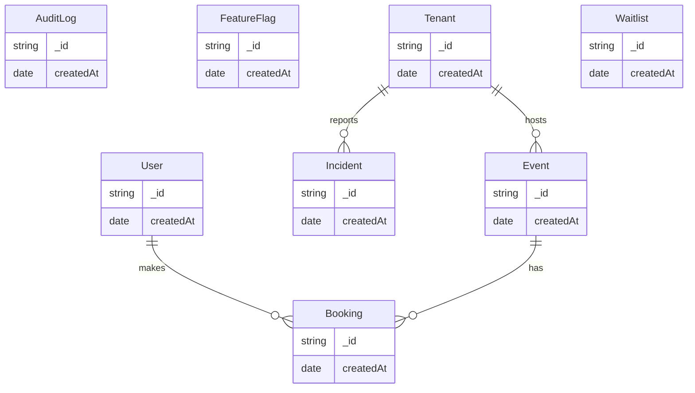
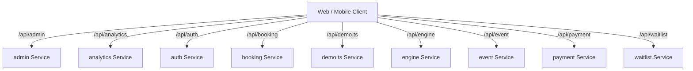
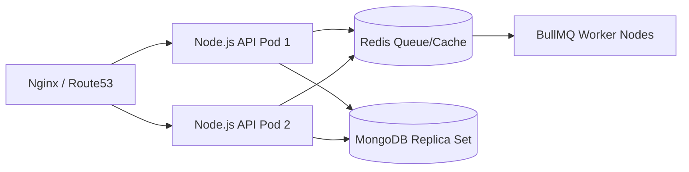

# System Architecture & Live Documentation
*Auto-generated on: 2026-07-17T07:30:05.042Z*

## 1. Entity Relationship (ER) Diagram

## 2. Microservice API Flow

## 3. Deployment Topology

## 4. Emergency Runbook
If this system goes down and the developer is missing:
1. Check `docker logs sems-app`
2. Verify Feature Flags in MongoDB (`FeatureFlag` collection)
3. Check `Incident` collection for recent P1 issues.
4. Run `pnpm run docs:generate` to rebuild this file.
